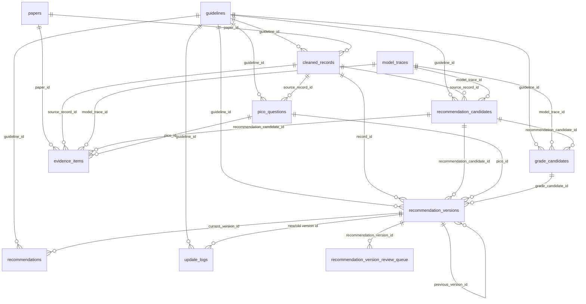

# Storage 表关系与入库说明

`src/storage/` 负责 PostgreSQL schema、通用入库、原子事务和完整性报告。它不负责抽取规则，也不负责决定某条推荐是否应该发布；这些判断来自 `pipeline/` 产物和发布门禁。

## 表关系图



## 核心表职责

- `guidelines`：指南来源和元数据。
- `papers`：论文或证据来源元数据。
- `cleaned_records`：清洗后的原始记录，是下游抽取的文本来源。
- `model_traces`：规则或模型抽取 trace，回答“这条结构化结果怎么来的”。
- `recommendation_candidates`：推荐候选，不是正式推荐。
- `grade_candidates`：GRADE/强度/确定性候选。
- `pico_questions`：临床问题结构。
- `evidence_items`：证据条目。
- `recommendation_versions`：正式推荐版本账本，原则上只保存 publishable 版本。
- `recommendations`：当前推荐状态，指向当前正式版本。
- `recommendation_version_review_queue`：被发布门禁拦下的版本审核队列。
- `update_logs`：正式发布后的更新事件。

## 原子入库顺序

`generic_ingest.py::ingest_tables_atomically()` 使用固定顺序写入业务 bundle：

```text
model_traces
-> pico_questions
-> recommendation_candidates
-> grade_candidates
-> recommendation_versions
-> recommendations
-> recommendation_version_review_queue
-> evidence_items
-> update_logs
```

这个顺序的目的：

1. 先写 trace 和候选实体，保证外键依赖存在。
2. 再写 publishable 的 `recommendation_versions`。
3. 再写 `recommendations` 当前态，让它可以指向已存在的正式版本。
4. 最后写 review queue、证据和 update logs。

如果任意一步失败，整个事务回滚。

## 发布门禁分流

`recommendation_versions` 入库前会检查 `normalized_payload.publish_gate`：

```text
publishable -> recommendation_versions
blocked / needs_review -> recommendation_version_review_queue
```

这条规则保护正式版本表不被低质量候选污染。发布审核通过后，应通过：

```text
pipeline/publish/recommendation_publisher.py
```

生成发布 bundle，并可使用 `--ingest` 走同一个原子入库路径。

## 维护规则

1. 新增表时，同时更新：
   - `schema_definitions.py`
   - `schema.py::SCHEMA_TABLES`
   - `schema.py::create_indexes`
   - `generic_ingest.py::GENERIC_TABLE_CONFIG`
   - `integrity_report()` 中必要的完整性检查
2. 修改外键时，检查原子入库顺序。
3. 修改 `recommendation_versions` 或 `recommendations` 时，必须运行发布相关测试。
4. 真实 PostgreSQL smoke test 默认跳过，显式设置 `RUN_POSTGRES_SMOKE=1` 后运行。

## 常用命令

初始化 schema：

```powershell
python -m src.storage.storage_PG init
```

查看表计数：

```powershell
python -m src.storage.storage_PG counts
```

查看完整性报告：

```powershell
python -m src.storage.storage_PG integrity-report
```

运行 live PostgreSQL 发布 smoke test：

```powershell
$env:RUN_POSTGRES_SMOKE="1"
python -m unittest tests.test_postgres_publish_smoke
```
