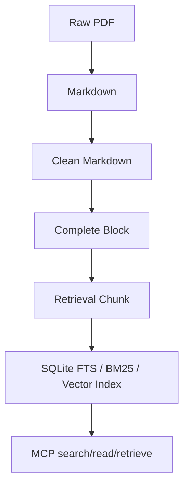

# Pipeline 数据流

`src/pipeline/` 现在保留当前任务真正需要的两层：

- `cleaning/`：PDF 转 Markdown、Markdown 清洗、block 编码、chunk 切分、建库。
- `orchestration/`：证据库构建入口，串联 cleaning 并输出 manifest。

旧的 Recommendation、PICO、GRADE、LLM review、publish、quality、update 等链路已经迁移到 `legacy_recommendation_pipeline/`，避免和当前“指南证据库”任务混在一起。

## 当前主流程

## 维护规则

1. 新增处理逻辑时，优先围绕 block 和 chunk 两个对象设计。
2. 不要在 active pipeline 里重新引入 Recommendation、PICO、GRADE 抽取。
3. MCP 检索需要的产物应写入同一个 `data_dir`，便于远程服务长期挂载。
