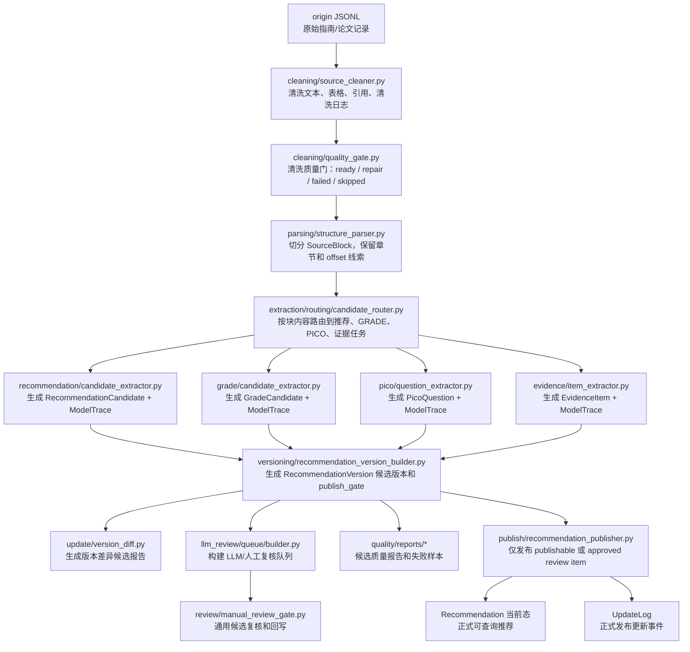
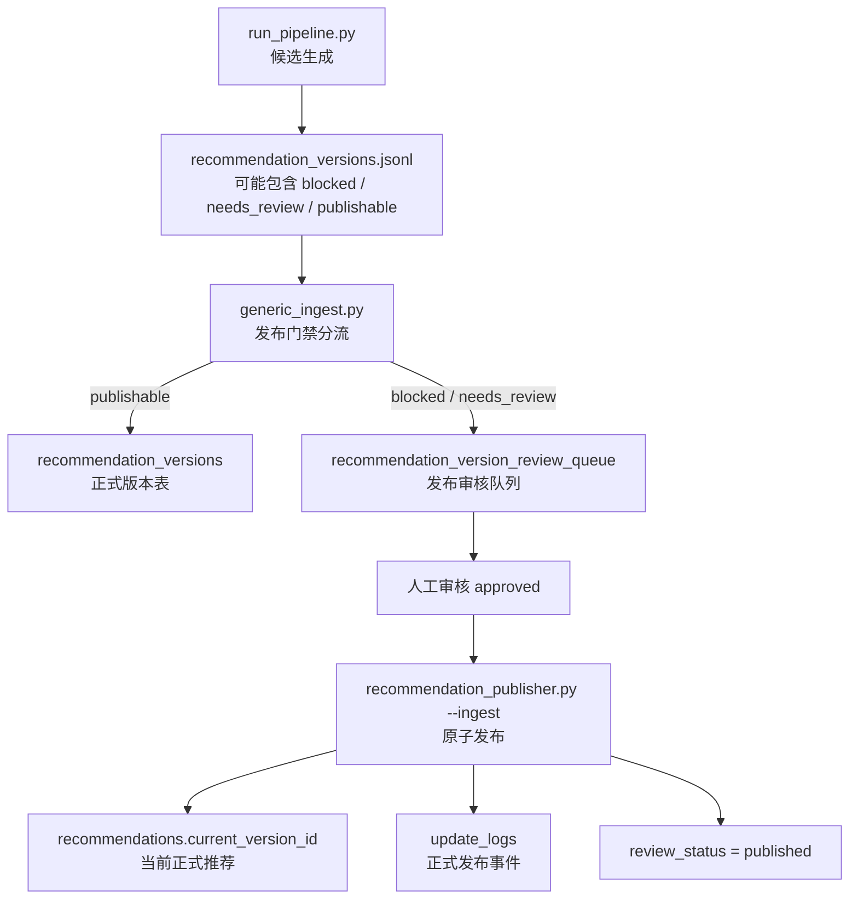

# Pipeline 数据流说明

`src/pipeline/` 负责把原始 JSONL 数据处理成可审核、可发布的 Living-Guideline 结构化产物。这里的核心原则是：

- `orchestration/run_pipeline.py` 只生成候选产物、质量报告和审核队列。
- `publish/recommendation_publisher.py` 才负责把审核通过的版本发布为正式当前推荐。
- 普通抽取流程不要直接写 `recommendations` 当前态，避免未审核候选污染正式知识库。

## 主数据流图

## 候选生成与正式发布的边界

## 包结构

- `cleaning/`：来源清洗、PDF 噪声处理、清洗质量门。
- `parsing/`：指南 profile 识别、结构块解析。
- `extraction/`：规则抽取主包。
  - `common/`：抽取层共享枚举、校验和映射。
  - `routing/`：SourceBlock 到任务输入的分流。
  - `recommendation/`：推荐语句候选抽取。
  - `pico/`：PICO 问题抽取。
  - `grade/`：GRADE 候选和推荐关联。
  - `evidence/`：证据条目和关联筛选。
  - `enhancement/`：LLM 后处理增强。
  - `versioning/`：不可变推荐版本和当前态构建。
  - `source_span/`：以源文本 span 为优先的实验抽取路径。
- `llm_review/`：LLM 复核队列、prompt、响应解析、auto QC。
- `review/`：通用人工复核队列构建和回写。
- `publish/`：正式发布编排，把 approved 版本写入当前态和更新日志。
- `quality/`：质量报告、goldset 评估和失败样本输出。
- `orchestration/`：端到端候选生成流水线入口。

## 维护规则

1. 修改抽取规则时，必须补充或更新对应测试 fixture。
2. 修改 `RecommendationVersion` 生成逻辑时，必须检查 `publish_gate` 是否仍能拦截低质量版本。
3. 修改发布流程时，必须保证 version、recommendation、update_log、review queue 状态同事务。
4. 不要把正式发布逻辑塞进 `run_pipeline.py`。
5. 移动模块时，同步更新 Python import、PowerShell 脚本和本 README 的数据流图。
