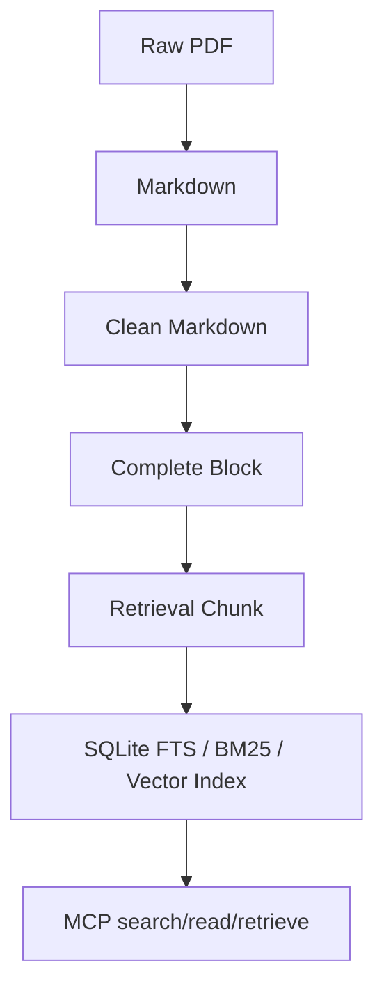

# Pipeline 数据流

`src/pipeline/` 负责把指南 PDF 处理成可检索证据库。

## 目录职责

| 目录 | 作用 |
| --- | --- |
| `cleaning/` | PDF 转 Markdown、Markdown 清洗、block 编码、chunk 切分。 |
| `ocr/` | OCR 辅助处理。 |
| `quality/` | Markdown 和索引产物的质量审计、修复脚本。 |
| `orchestration/` | 一键构建证据库入口。 |

## 当前主流程

旧的 Recommendation、PICO、GRADE、LLM review、publish 等链路已经迁移到 `legacy_recommendation_pipeline/`。
